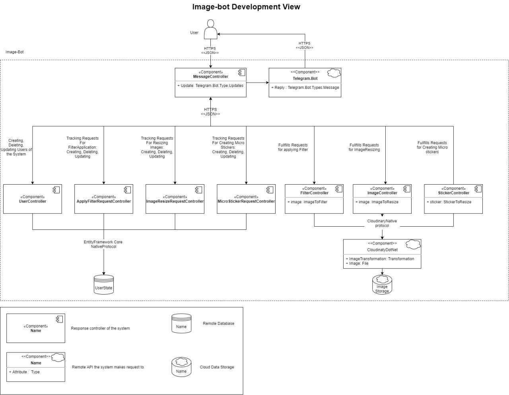
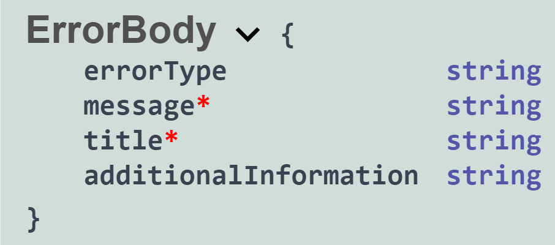

# image-bot
A Telegram bot that is capable of resizing images, applying filters and creating micro-srickers out of existing Telegram sticker packs 
- Platform: web
# Features
- resize image
- create micro-stickers
- apply filters on image
# Limitation
- only authorized Telegram users
- only non-animated stickers
- the image or link to the image should be received via Telegram chat
- size of the image should be less than 3mb
- 1920x1080 resolution
- only .png, .bmp, .jpg
# User stories
## Feature 0: resize image
- As a user I want to be able to change resolution of an image so that I can save the disk space on my device
### Acceptance criteria
- The application should offer available image format
- An output image should be of the chosen by user format
##
- 2. As a user I want to be able to download images to the bot from my local hard drive or from the Internet so that I can process ones from different sources
### Acceptance criteria
- The bot should notify user if the link or the image is invalid and cancel the operation
- After the image is uploaded, the bot should offer available resizing options(make bigger or smaller)
## Feature 1: create micro-stickers
- As a user I want to be able to create micro-stickers from sticker pack that already exists in Telegram so that I can use them when I have low Internet speed
### Acceptance criteria
- User can send either default telegram stickers or custom ones made in Telegram Stickers bot
- The application should offer available sticker size
- Sticker pack name should be autocomplete field with original sticker pack name
- The bot should notify the user if the sticker pack is animated and cancel the operation
## Feature 2: apply filters on image
- As a user I want to be able to apply filters on my photos so that I can make my photos look better
### Acceptance criteria
- The application should offer examples of available filters
- The available filters are: black and white, white and black, negative, lo-fi, hefe, nashwille, hudson, rise, mayfair
- The bot should notify the user in case filter apllying API is unavailable and cancel the operaation
## Wireframe
https://s3.amazonaws.com/assets.mockflow.com/app/wireframepro/company/C4fb765ef57424da78bb52e31a787de4e/projects/M319477100ced05987ca571ac0ab38ca21600159454912/pages/e7af36e065e54b5caf2a6605d947714b/image/e7af36e065e54b5caf2a6605d947714b.png 
## High-Level Decisions
### Development View

- User interacts with the application via Telegram Client, which send update messages every time a new chat message is sent to a client. Webhook technology is used for this purpose. Message Controller acts as a mediator making decisions on what API call should be performed. User command sent in chat are translated into API calls.
- User Controller keeps track of all the users interacting with the Bot. Apply Filter Request Controller, Image Resize Request Controller, Micro Sticker Request Controller represent the state and parameters of a particular User request performed at the moment.
- Filter Controller, Image Controller, Sticker Controller fulfil the request. By means Cloudinary.Net these Controllers apply transformation on requests. Cloudinary.Net stores transformed images for further access.
- After transformation complete Message Controller recieves it's result and sends it to the User by means of Telegram.Bot.
## API Design Guideline
- Based on: https://docs.microsoft.com/en-us/azure/architecture/best-practices/api-design
- Protocol: HTTPS
- Format: JSON
- REST API
- Singular Nouns for Elements-Resources, Plural Nouns for Elements-Collections
- API Versioning : api/{version}/... The base version is 1.0.0. Minor fixes increment last digit. New features inside existing entities increment middle digit. Global changes increment first digit.
### Methods Description
### Default Error Body

- Fields marked with * are required
- Error Type contains information on the origin of an error (DB, Validaton etc)
- Message contains detail information on what happened
- Ttile describes the main problem that happened.
- AdditionalInformation may be needed for complex errors.
#### GET
- 200(OK) on success. Returns the required object at response body
- 404(Not Found) if the resource cannot be found. Returns the default error body 
- No body required.
#### POST
- 201(Created) on a successful resource creation. Returns the URI of the created object at the Location header of the response and the created object itself at the response body
- 204(No content) if some operation were made, but resource was not created. There is no additional content to send in the response payload body.
- 400(Bad Request) if the client puts invalid data into the request. Returns the default error body with the additional information about the data caused error.
- Might have a body with a resource to create.
#### PUT
- 201(Created) on a successful resource creation. Returns the URI of the created object at the Location header of the response and the created object itself at the response body
- 200(OK) or 204(No content) if the existing resource was updated. There is no additional content to send in the response payload body.
- 409(Conflict) when the resource update is not possible. Returns the default error body with the additional information about the data cannot be updated.
- Body with a resource to create or update is required.
#### DELETE
- 204(No Content) on a successful resource delete. There is no additional content to send in the response payload body
- 404(Not Found) if the resource cannot be found. Returns the default error body
- No body required.
### Non-Standart Methods
Not-Standart methods are not available
