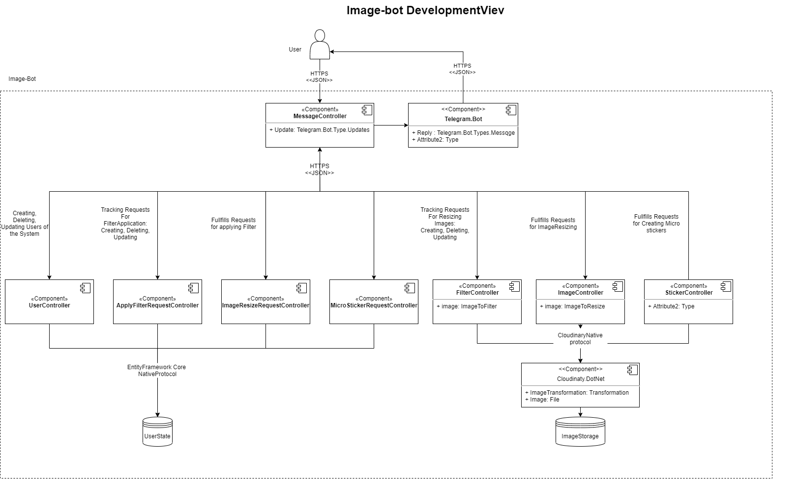

# image-bot
A Telegram bot that is capable of resizing images, applying filters and creating micro-srickers out of existing Telegram sticker packs 
- Platform: web
# Features
- resize image
- create micro-stickers
- apply filters on image
# Limitation
- only authorized Telegram users
- only non-animated stickers
- the image or link to the image should be received via Telegram chat
- size of the image should be less than 3mb
- 1920x1080 resolution
- only .png, .bmp, .jpg
# User stories
## Feature 0: resize image
- As a user I want to be able to change resolution of an image so that I can save the disk space on my device
### Acceptance criteria
- The application should offer available image format
- An output image should be of the chosen by user format
##
- 2. As a user I want to be able to download images to the bot from my local hard drive or from the Internet so that I can process ones from different sources
### Acceptance criteria
- The bot should notify user if the link or the image is invalid and cancel the operation
- After the image is uploaded, the bot should offer available resizing options(make bigger or smaller)
## Feature 1: create micro-stickers
- As a user I want to be able to create micro-stickers from sticker pack that already exists in Telegram so that I can use them when I have low Internet speed
### Acceptance criteria
- User can send either default telegram stickers or custom ones made in Telegram Stickers bot
- The application should offer available sticker size
- Sticker pack name should be autocomplete field with original sticker pack name
- The bot should notify the user if the sticker pack is animated and cancel the operation
## Feature 2: apply filters on image
- As a user I want to be able to apply filters on my photos so that I can make my photos look better
### Acceptance criteria
- The application should offer examples of available filters
- The available filters are: black and white, white and black, negative, lo-fi, hefe, nashwille, hudson, rise, mayfair
- The bot should notify the user in case filter apllying API is unavailable and cancel the operaation
## Wireframe
https://s3.amazonaws.com/assets.mockflow.com/app/wireframepro/company/C4fb765ef57424da78bb52e31a787de4e/projects/M319477100ced05987ca571ac0ab38ca21600159454912/pages/e7af36e065e54b5caf2a6605d947714b/image/e7af36e065e54b5caf2a6605d947714b.png 
## High-Level Decisions
### Development View

## API Design Guideline
- Protocol: HTTPS
- Format: JSON
- REST API
- Singular Nouns for Elements-Resources, Plural Nouns for Elements-Collections
- API Versioning : api/{version}/... The base version is 1.0.0. Minor fixes increment last digit. New features inside existing entities increment middle digit. Global changes increment first digit.
- GET methods return 200(OK) on success and 404(Not Found if the resource cannot be found. No body required. POST methods returns 201(Created) on successful resource creation and the URI of the new resource is included in the Location header of the response. The response body contains a representation of the resource. If the method does some processing but does not create a new resource, the method can return HTTP status code 204(No Content). If the client puts invalid data into the request, the server should return HTTP status code 400 (Bad Request). POST methods might have a body. PUT methods return 201(Created) on successful resource creation. If the method updates an existing resource, it returns either 200 (OK) or 204 (No Content). When updating is not possible then the method returns 409(Conflict). PUT methods require body. DELETE methods return 204(No Content) on a successful delete. If the resource doesn't exist, the web server return 404 (Not Found). No body required.
- No other methods available.
